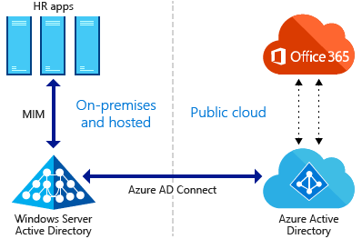
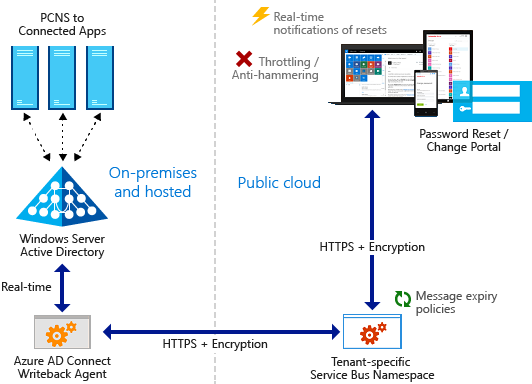
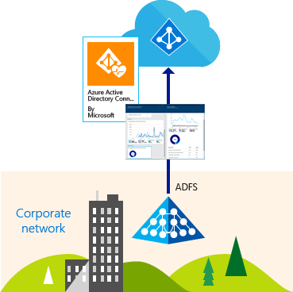
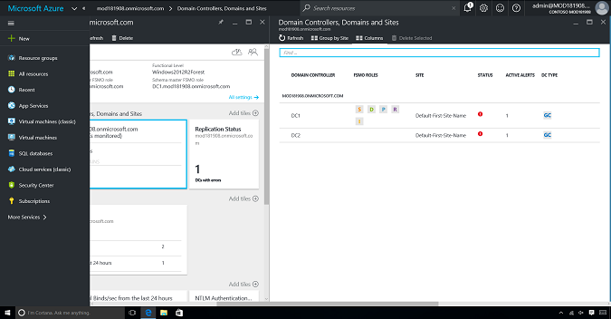
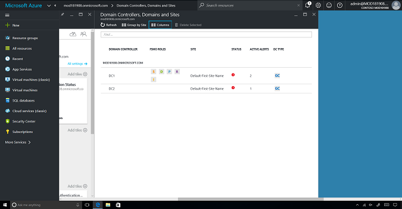
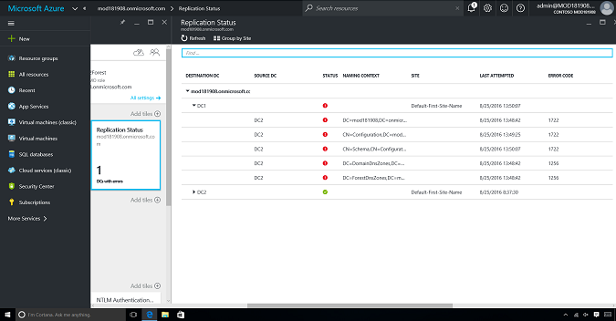
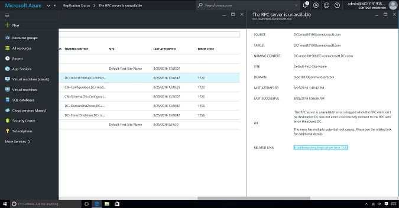
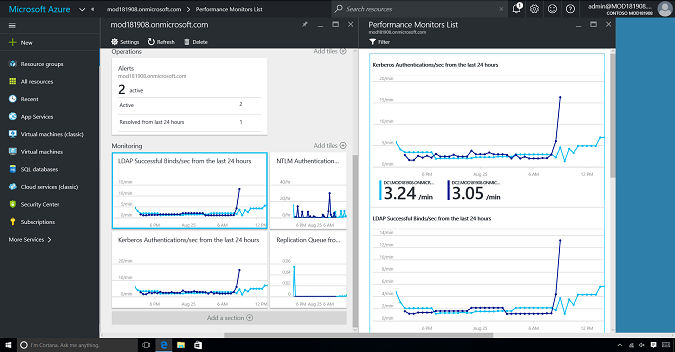

---
# required metadata

title: Manage access at scale
description: This article describes how Enterprise Mobility + Security can be used to empower an organization with identity access management by leveraging tools within Azure Active Directory.
keywords:
author: andredm7
ms.author: andredm
manager: swadhwa
ms.date: 10/18/2016
ms.topic: article
ms.prod:
ms.service: active-directory
ms.technology:
ms.assetid: 0292919a-af10-4a25-8916-c704aed643f6

# optional metadata

ROBOTS: noindex
#audience:
#ms.devlang:
ms.reviewer: atkladak, jsnow
ms.suite: ems
#ms.tgt_pltfrm:
#ms.custom:

---

# Manage access at scale
Microsoft has been empowering organizations since its existence. Microsoft provides not only identity that takes you everywhere, but also a set of tools to automate, help secure, and manage IT within your organization. Even after the advent of cloud computing, there is still demand to manage and control IT tasks like helpdesk calls to reset user passwords, user group management, and application requests.

## How Enterprise Mobility + Security can help you
Enterprise Mobility + Security (EMS) is the only comprehensive cloud solution that natively helps protect corporate data on the device itself and beyond with four layers of protection across identities, devices, apps, and data. EMS helps you solve one of the key challenges in the mobile-first, cloud-first world—how to provide a comprehensive set of tools within Azure Active Directory (Azure AD) that will help you with the following:
- Advanced user lifecycle management
- Low IT overhead and cost
- Monitoring your identity bridge

## Recommended solution
Azure AD Premium is the recommended solution to empower your organization with identity access management.

### Advanced user lifecycle management
Azure AD provides automated, advanced user lifecycle management by using dynamic group membership rules and application management capabilities. Here’s more detail:

- For organizations with on-premises HR, Microsoft Identity Manager establishes user identities in Windows Server Active Directory.
- For organizations with software as a service (SaaS)–delivered HR, Azure AD currently integrates with Workday.
- Azure AD Connect syncs users and groups between Windows Server Active Directory and Azure AD.
- Azure AD provides group-based automated licensing for Office 365 and other Microsoft online services.

### Application management
How many users like to remember passwords for each application they use every day? [Single sign-on](https://azure.microsoft.com/en-us/documentation/articles/active-directory-appssoaccess-whatis/) addresses this common problem. You can log in to several SaaS applications by using a single user account and password. Single sign-on can be automatically provisioned for all the applications within your organization. This capability is available for Microsoft cloud applications like Office 365, and for third-party applications like Salesforce, ServiceNow, and Workday.

Here’s more detail about single sign-on:

 - It works in the cloud, so you can save time and money. On-premises solutions require you to set up and maintain perimeter networks, edge servers, or other complex infrastructures.
 - It is easier to set up and secure than on-premises solutions because you don't have to open any inbound connections through your firewall.
 - It offers great security. When you publish your apps by using Azure AD Application Proxy, you can take advantage of the authorization controls and security analytics in Azure. This means that you get advanced security capabilities for all your existing apps without having to change any app.
 - It gives your users a consistent authentication experience. Single sign-on gives your users access to all the apps they need to be productive with one password.

### Low IT overhead and cost
Azure AD Premium offers self-service for password reset, group management, and app management capabilities to empower IT and users’ productivity in your organization. There’s no need for users to make a helpdesk phone call and provide a lot of information to get a temporary password that’s sent in e-mail or shared during the call in an unsecured way.

Here’s more detail about password reset:

- It works with federation, password sync, or cloud-only user accounts. It also enforces all your on-premises password policies.
- All traffic is encrypted with a tenant-specific key, and over HTTPS.
- Users can update their AD password or unlock their own AD accounts in real time.
- Real-time notifications are sent to users and admins.

### Monitor your identity bridge
Azure AD Connect Health helps organizations to monitor and gain insight into their on-premises identity infrastructure and the synchronization services. It also helps organizations maintain a reliable connection to Office 365 and Microsoft Online Services by providing monitoring capabilities for their key identity components. These components include Active Directory Federation Services (AD FS) servers, Azure AD Connect servers, and Active Directory domain controllers (DCs).

Here’s more detail about Azure AD Health:

- One-click audit and compliance through the Azure portal
- Forensics and investigation: helps IT admins to answer “who did what, where, and when”
- Activity reports: provides audit, sign-ins, self-service password reset, group activity, app activity, app provisioning, and more
- Security reports: provides mitigation and resolution for security anomalies through identity protection

## How to implement an advanced user lifecycle management
Let’s go through a few examples and the steps that you might take to implement this solution:

1. In a real-world scenario, your organization hires a professional and adds a user to the HR system as a member of the Marketing team.
2.	Assuming you’ve already integrated your on-premises Active Directory instance with Azure AD through directory synchronization, the on-premises Azure AD Connect syncs the user account with Azure AD.
3.	After the user account appears on Azure AD, you can create dynamic group membership rules that automatically assign Marketing users to it.
4.	After the Marketing group is automatically populated with its users, you can use group-based selective licensing. This kind of licensing gives you the ability to add users to a specific license group, like Azure AD Premium or Office 365 Enterprise E5.
    In this example, that gives the users access to all the required Office 365 apps they need to do their work, as well as Azure AD Premium accesses to do other automated tasks.

If an employee needs to leave the company, you can remove them from the HR system. This automatically removes access from all the applications and resources previously provisioned to them. If the employee just needs to move to another department, the dynamic group membership rules automatically remove access from Marketing applications and add access to another department’s applications as the user is removed from the Marketing team and added to the new department’s dynamic group.

## How to manage cloud and on-premises applications
Here are steps that you can take to add, deploy, and manage Microsoft and third-party SaaS applications by using Azure AD:
- Learn more about [integrating Azure AD with applications](https://azure.microsoft.com/documentation/articles/active-directory-integrating-applications-getting-started/).
- Learn more about [enabling single sign-on to SaaS apps](https://azure.microsoft.com/documentation/articles/active-directory-sso-integrate-saas-apps/).
- Learn more about [managing access to apps](https://azure.microsoft.com/documentation/articles/active-directory-managing-access-to-apps/).

## How to implement password reset self-service portal
By default, Azure AD comes with a free feature that lets every admin perform their own self-service password reset.

When you’re using Azure AD Premium, you can go beyond IT admins by providing password reset self-service portal capabilities for your users. You can quickly enable user password reset policies that will extend the same admin capabilities to every user within your directory.

Learn more about the [prerequisites, how to enable, and how to set up the password self-service portal](https://azure.microsoft.com/en-us/documentation/articles/active-directory-accessmanagement-manage-groups/) on your Azure AD tenant.

## How to use Azure AD Connect Health
You can check the [Azure AD Connect Health documentation](https://azure.microsoft.com/en-in/documentation/articles/active-directory-aadconnect-health/) to gather more information about the tool, its capabilities, and the steps you can take to start using it in your organization.

Azure AD Connect Health is available in the [Azure portal](https://ms.portal.azure.com) and requires a health agent to be installed on the on-premises domain controllers that you want to monitor. Learn more about [how to install the health agent](https://azure.microsoft.com/en-in/documentation/articles/active-directory-aadconnect-health-agent-install/).

The **Domain Controllers** dashboard provides a single view into the health and operational status of the environment. There, the admin can easily find which DCs are Flexible Single Master Operations (FSMO) role owners, which DCs have active alerts, and which DCs are global catalogs. Other columns include **PDC reachable**, **GC reachable**, and **SYSVOL state**.

In addition, DCs can be grouped by their corresponding domain, or the admin can group them by site.

The **Replication Status** dashboard shows what the replication topology looks like within the environment, along with information about the last replication attempt for each naming context.

The details of an alert have more information about the issue that’s causing the alert, the required fix, and a link to more troubleshooting resources.

AD Connect Health performance monitoring provides an easy way to compare the performance of the monitored DCs against each other, as well as comparing different metrics of interest.

